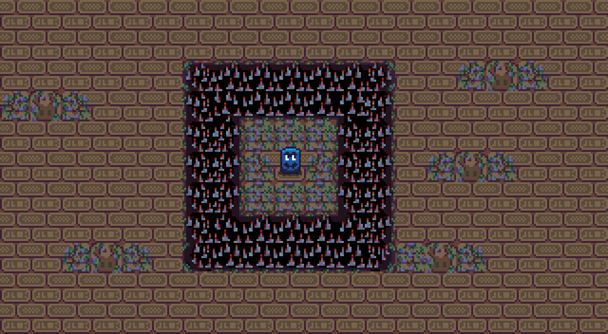

# Godot Game Engine Practice

This prototype is a pixel art 2D thing.

This is a remake of the one of the previous creator's game ["SwitchBot" created for the Wowie Jam 4.0 GameJam](https://sonicmam.itch.io/switchbot).

The goal of the inital game was leading big block enemies through a hidden temple filled with traps. Your mission is to guide the block enemies over switches scattered throughout each level, which will activate crawlspaces that lead to the next challenge.

Language: C#

Renderer: GLES 2

## Screenshots

